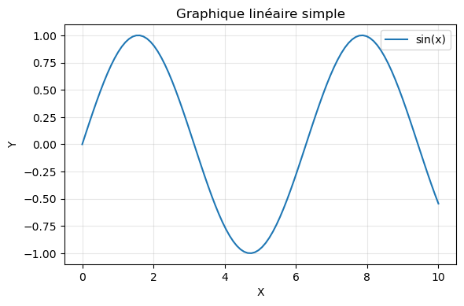
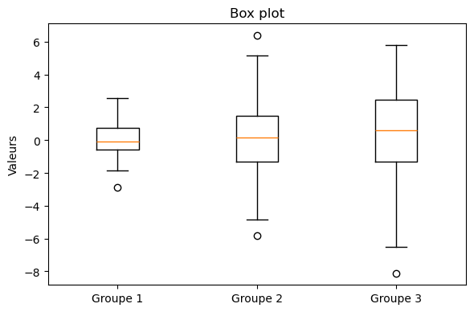

# Matplotlib - Guide de référence rapide

> Pense-bête complet pour maîtriser Matplotlib - Bibliothèque fondamentale pour la visualisation de données en Python

---

## Table des matières

1. [Installation et import](#installation-et-import)
2. [Concepts de base](#concepts-de-base)
3. [Graphiques linéaires](#graphiques-linéaires)
4. [Nuages de points (Scatter)](#nuages-de-points-scatter)
5. [Histogrammes](#histogrammes)
6. [Graphiques en barres](#graphiques-en-barres)
7. [Graphiques circulaires](#graphiques-circulaires)
8. [Subplots (plusieurs graphiques)](#subplots-plusieurs-graphiques)
9. [Personnalisation avancée](#personnalisation-avancée)
10. [Styles et thèmes](#styles-et-thèmes)
11. [Sauvegarde de figures](#sauvegarde-de-figures)
12. [Manipulation d'images](#manipulation-dimages)
13. [Méthodes utiles supplémentaires](#méthodes-utiles-supplémentaires)

---

## Installation et import

```python
import matplotlib.pyplot as plt
import numpy as np
```

**Convention standard** : importer Matplotlib avec `import matplotlib.pyplot as plt`.

**Installation** :
```bash
pip install matplotlib
# ou avec conda
conda install matplotlib
```

---

## Concepts de base

### Structure d'une figure Matplotlib

```python
# Méthode 1 : Interface pyplot (simple)
plt.plot([1, 2, 3, 4], [1, 4, 9, 16])
plt.xlabel('X')
plt.ylabel('Y')
plt.title('Mon graphique')
plt.show()

# Méthode 2 : Interface orientée objet (recommandée)
fig, ax = plt.subplots()
ax.plot([1, 2, 3, 4], [1, 4, 9, 16])
ax.set_xlabel('X')
ax.set_ylabel('Y')
ax.set_title('Mon graphique')
plt.show()
```

**Schéma conceptuel :**
```
Figure (fig)
└── Axes (ax) - Zone de tracé
    ├── Titre
    ├── Axe X (avec label)
    ├── Axe Y (avec label)
    └── Données (courbes, points, etc.)
```

### Création de figures et axes

```python
# Figure simple avec un seul axe
fig, ax = plt.subplots()

# Figure avec plusieurs axes (grille)
fig, axes = plt.subplots(2, 2)  # 2 lignes, 2 colonnes
axes[0, 0].plot([1, 2, 3], [1, 2, 3])  # Premier graphique

# Figure avec taille personnalisée
fig, ax = plt.subplots(figsize=(10, 6))  # Largeur, Hauteur en pouces

# Figure sans axes (pour images)
fig, ax = plt.subplots()
ax.axis('off')  # Masquer les axes
```

---

## Graphiques linéaires

### Graphique linéaire simple

```python
import matplotlib.pyplot as plt
import numpy as np

x = np.linspace(0, 10, 100)
y = np.sin(x)

fig, ax = plt.subplots(figsize=(6, 4))
ax.plot(x, y)
ax.set_xlabel('X')
ax.set_ylabel('Y')
ax.set_title('Graphique linéaire simple')
ax.grid(True, alpha=0.3)
plt.tight_layout()
plt.show()
```



### Graphique avec plusieurs courbes

```python
x = np.linspace(0, 10, 100)
fig, ax = plt.subplots(figsize=(6, 4))
ax.plot(x, np.sin(x), label='sin(x)')
ax.plot(x, np.cos(x), label='cos(x)')
ax.set_xlabel('X')
ax.set_ylabel('Y')
ax.set_title('Plusieurs courbes')
ax.legend()
ax.grid(True, alpha=0.3)
plt.tight_layout()
plt.show()
```


### Personnalisation des lignes

```python
# Styles de ligne
ax.plot(x, y, linestyle='-')      # Ligne continue (défaut)
ax.plot(x, y, linestyle='--')     # Ligne pointillée
ax.plot(x, y, linestyle='-.')     # Ligne pointillée-trait
ax.plot(x, y, linestyle=':')      # Ligne pointillée
ax.plot(x, y, linestyle='None')   # Pas de ligne (seulement marqueurs)

# Couleurs
ax.plot(x, y, color='red')
ax.plot(x, y, color='#FF5733')    # Code hexadécimal
ax.plot(x, y, color='blue', alpha=0.5)  # Transparence

# Marqueurs
ax.plot(x, y, marker='o')         # Cercle
ax.plot(x, y, marker='s')         # Carré
ax.plot(x, y, marker='^')         # Triangle
ax.plot(x, y, marker='x')         # Croix
ax.plot(x, y, marker='.', markersize=10)  # Taille des marqueurs

# Combinaison
ax.plot(x, y, 'ro-', label='Données')  # r=rouge, o=marqueur cercle, -=ligne
ax.plot(x, y, 'b--s', linewidth=2, markersize=8)  # Style complet
```

**Codes de style courts :**
```
Format: '[couleur][marqueur][ligne]'
Exemples:
- 'ro-' : rouge, cercle, ligne continue
- 'b--' : bleu, ligne pointillée
- 'g^:' : vert, triangle, ligne pointillée
```

---

## Nuages de points (Scatter)

### Nuage de points de base

```python
x = np.random.randn(100)
y = np.random.randn(100)

fig, ax = plt.subplots(figsize=(6, 4))
ax.scatter(x, y)
ax.set_xlabel('X')
ax.set_ylabel('Y')
ax.set_title('Nuage de points')
plt.tight_layout()
plt.show()
```

### Nuage de points avec couleurs et tailles

```python
x = np.random.randn(100)
y = np.random.randn(100)
colors = np.random.rand(100)  # Couleurs aléatoires
sizes = 1000 * np.random.rand(100)  # Tailles aléatoires

fig, ax = plt.subplots(figsize=(6, 4))
ax.scatter(x, y, c=colors, s=sizes, alpha=0.6)
ax.set_xlabel('X')
ax.set_ylabel('Y')
ax.set_title('Nuage de points')
plt.tight_layout()
plt.show()
```


### Nuage de points avec colormap

```python
x = np.random.randn(100)
y = np.random.randn(100)
z = np.random.randn(100)  # Valeur pour la couleur

fig, ax = plt.subplots(figsize=(6, 4))
scatter = ax.scatter(x, y, c=z, cmap='viridis', s=100, alpha=0.6)
plt.colorbar(scatter, ax=ax, label='Valeur Z')
ax.set_xlabel('X')
ax.set_ylabel('Y')
ax.set_title('Nuage de points avec colormap')
plt.tight_layout()
plt.show()
```

**Colormaps courantes :**
- `'viridis'`, `'plasma'`, `'inferno'` : Séquentielles
- `'coolwarm'`, `'RdYlBu'` : Divergentes
- `'Set1'`, `'Set2'`, `'tab10'` : Catégorielles

---

## Histogrammes

### Histogramme simple

```python
data = np.random.normal(100, 15, 1000)  # Distribution normale

fig, ax = plt.subplots(figsize=(6, 4))
ax.hist(data, bins=30, edgecolor='black', alpha=0.7)
ax.set_xlabel('Valeur')
ax.set_ylabel('Fréquence')
ax.set_title('Histogramme')
plt.tight_layout()
plt.show()
```


### Histogrammes multiples

```python
data1 = np.random.normal(100, 15, 1000)
data2 = np.random.normal(120, 20, 1000)

fig, ax = plt.subplots(figsize=(6, 4))
ax.hist(data1, bins=30, alpha=0.5, label='Groupe 1', color='blue')
ax.hist(data2, bins=30, alpha=0.5, label='Groupe 2', color='red')
ax.set_xlabel('Valeur')
ax.set_ylabel('Fréquence')
ax.set_title('Histogrammes multiples')
ax.legend()
plt.tight_layout()
plt.show()
```

### Histogramme empilé

```python
fig, ax = plt.subplots(figsize=(6, 4))
ax.hist([data1, data2], bins=30, stacked=True, label=['Groupe 1', 'Groupe 2'])
ax.set_xlabel('Valeur')
ax.set_ylabel('Fréquence')
ax.set_title('Histogramme empilé')
ax.legend()
plt.tight_layout()
plt.show()
```

### Options d'histogramme

```python
# Nombre de bins
ax.hist(data, bins=50)              # 50 bins
ax.hist(data, bins='auto')          # Nombre automatique
ax.hist(data, bins=[0, 50, 100, 150, 200])  # Bins personnalisés

# Orientation
ax.hist(data, bins=30, orientation='horizontal')  # Horizontal

# Densité (normalisation)
ax.hist(data, bins=30, density=True)  # Aire = 1
```

---

## Graphiques en barres

### Graphique en barres verticales

```python
categories = ['A', 'B', 'C', 'D', 'E']
values = [23, 45, 56, 78, 32]

fig, ax = plt.subplots(figsize=(6, 4))
ax.bar(categories, values, color=['red', 'green', 'blue', 'orange', 'purple'])
ax.set_xlabel('Catégories')
ax.set_ylabel('Valeurs')
ax.set_title('Graphique en barres')
plt.tight_layout()
plt.show()
```


### Graphique en barres horizontales

```python
fig, ax = plt.subplots(figsize=(6, 4))
ax.barh(categories, values, color=['red', 'green', 'blue', 'orange', 'purple'])
ax.set_xlabel('Valeurs')
ax.set_ylabel('Catégories')
ax.set_title('Graphique en barres horizontales')
plt.tight_layout()
plt.show()
```


### Barres groupées

```python
categories = ['A', 'B', 'C']
values1 = [23, 45, 56]
values2 = [30, 50, 60]

x = np.arange(len(categories))
width = 0.35

fig, ax = plt.subplots(figsize=(6, 4))
ax.bar(x - width/2, values1, width, label='Groupe 1')
ax.bar(x + width/2, values2, width, label='Groupe 2')
ax.set_xlabel('Catégories')
ax.set_ylabel('Valeurs')
ax.set_title('Barres groupées')
ax.set_xticks(x)
ax.set_xticklabels(categories)
ax.legend()
plt.tight_layout()
plt.show()
```

### Barres empilées

```python
fig, ax = plt.subplots(figsize=(6, 4))
ax.bar(categories, values1, label='Groupe 1')
ax.bar(categories, values2, bottom=values1, label='Groupe 2')
ax.set_xlabel('Catégories')
ax.set_ylabel('Valeurs')
ax.set_title('Barres empilées')
ax.legend()
plt.tight_layout()
plt.show()
```

---

## Graphiques circulaires

### Graphique circulaire simple

```python
categories = ['A', 'B', 'C', 'D', 'E']
values = [23, 45, 56, 78, 32]

fig, ax = plt.subplots(figsize=(6, 6))
ax.pie(values, labels=categories, autopct='%1.1f%%', startangle=90)
ax.set_title('Graphique circulaire')
plt.tight_layout()
plt.show()
```


### Personnalisation du graphique circulaire

```python
# Explosion (séparer une section)
explode = (0.1, 0, 0, 0, 0)  # Exploser la première section

# Couleurs personnalisées
colors = ['#ff9999', '#66b3ff', '#99ff99', '#ffcc99', '#ff99cc']

# Ombres
shadow = True

fig, ax = plt.subplots(figsize=(6, 6))
ax.pie(values, labels=categories, autopct='%1.1f%%', 
       startangle=90, explode=explode, colors=colors, shadow=shadow)
ax.set_title('Graphique circulaire personnalisé')
plt.tight_layout()
plt.show()
```

---

## Subplots (plusieurs graphiques)

### Création de subplots

```python
# Grille 2x2
fig, axes = plt.subplots(2, 2, figsize=(10, 8))

x = np.linspace(0, 10, 100)
axes[0, 0].plot(x, np.sin(x))
axes[0, 0].set_title('sin(x)')

axes[0, 1].plot(x, np.cos(x), 'r')
axes[0, 1].set_title('cos(x)')

axes[1, 0].scatter(np.random.randn(50), np.random.randn(50))
axes[1, 0].set_title('Scatter')

axes[1, 1].bar(categories[:3], values[:3])
axes[1, 1].set_title('Barres')

plt.tight_layout()
plt.show()
```


### Subplots avec partage d'axes

```python
# Partager les axes X
fig, axes = plt.subplots(2, 1, sharex=True, figsize=(8, 6))
axes[0].plot(x, np.sin(x))
axes[1].plot(x, np.cos(x))

# Partager les axes Y
fig, axes = plt.subplots(1, 2, sharey=True, figsize=(10, 4))
axes[0].plot(x, np.sin(x))
axes[1].plot(x, np.cos(x))
```

### Subplots avec GridSpec (disposition avancée)

```python
from matplotlib.gridspec import GridSpec

fig = plt.figure(figsize=(10, 8))
gs = GridSpec(3, 3, figure=fig)

ax1 = fig.add_subplot(gs[0, :])  # Première ligne, toutes les colonnes
ax2 = fig.add_subplot(gs[1, :2])  # Deuxième ligne, deux premières colonnes
ax3 = fig.add_subplot(gs[1:, 2])  # À partir de la deuxième ligne, dernière colonne
ax4 = fig.add_subplot(gs[2, 0])  # Troisième ligne, première colonne
ax5 = fig.add_subplot(gs[2, 1])  # Troisième ligne, deuxième colonne

# Ajouter des graphiques...
plt.tight_layout()
plt.show()
```

---

## Personnalisation avancée

### Labels et titres

```python
ax.set_xlabel('Label X', fontsize=12, fontweight='bold')
ax.set_ylabel('Label Y', fontsize=12)
ax.set_title('Titre du graphique', fontsize=14, pad=20)

# Titre avec LaTeX
ax.set_title(r'$\alpha = \beta^2 + \gamma$')

# Labels multiples
ax.set_xlabel('X', labelpad=10)  # Espacement
```

### Limites des axes

```python
# Définir les limites
ax.set_xlim(0, 10)
ax.set_ylim(-1, 1)

# Limites automatiques avec marge
ax.set_xlim(auto=True)
ax.margins(x=0.1, y=0.1)  # 10% de marge
```

### Grille et axes

```python
# Grille
ax.grid(True, alpha=0.3, linestyle='--', linewidth=0.5)
ax.grid(True, which='major', color='gray', linestyle='-', alpha=0.3)
ax.grid(True, which='minor', color='gray', linestyle=':', alpha=0.2)

# Graduations
ax.set_xticks([0, 2, 4, 6, 8, 10])
ax.set_xticklabels(['Zéro', 'Deux', 'Quatre', 'Six', 'Huit', 'Dix'])

# Rotation des labels
ax.tick_params(axis='x', rotation=45)

# Masquer les axes
ax.axis('off')  # Tous les axes
ax.spines['top'].set_visible(False)  # Masquer le haut
ax.spines['right'].set_visible(False)  # Masquer la droite
```

### Légendes

```python
# Légende simple
ax.legend()

# Position de la légende
ax.legend(loc='upper right')
ax.legend(loc='best')  # Position automatique optimale
ax.legend(loc='center left', bbox_to_anchor=(1, 0.5))  # À droite du graphique

# Personnalisation
ax.legend(frameon=True, fancybox=True, shadow=True, ncol=2)
```

**Positions de légende :**
- `'upper right'`, `'upper left'`, `'lower right'`, `'lower left'`
- `'upper center'`, `'lower center'`, `'center left'`, `'center right'`
- `'center'`, `'best'`

### Annotations et texte

```python
# Annotation avec flèche
ax.annotate('Point important', xy=(5, 0.5), xytext=(7, 0.8),
            arrowprops=dict(arrowstyle='->', color='red'))

# Texte simple
ax.text(5, 0.5, 'Texte à la position (5, 0.5)', fontsize=12)

# Annotation de point
ax.plot(5, 0.5, 'ro', markersize=10)
ax.annotate('Maximum', xy=(5, 0.5), xytext=(6, 0.7),
            arrowprops=dict(facecolor='black', shrink=0.05))
```

---

## Styles et thèmes

### Styles prédéfinis

```python
# Voir les styles disponibles
print(plt.style.available)

# Appliquer un style
plt.style.use('seaborn-v0_8')  # Style moderne
plt.style.use('ggplot')         # Style R ggplot2
plt.style.use('dark_background')  # Fond sombre
plt.style.use('classic')        # Style classique

# Style temporaire
with plt.style.context('dark_background'):
    fig, ax = plt.subplots()
    ax.plot(x, y)
    plt.show()
```

### Personnalisation globale (rcParams)

```python
# Configuration globale
plt.rcParams['figure.figsize'] = (10, 6)
plt.rcParams['font.size'] = 12
plt.rcParams['axes.labelsize'] = 14
plt.rcParams['axes.titlesize'] = 16
plt.rcParams['xtick.labelsize'] = 12
plt.rcParams['ytick.labelsize'] = 12
plt.rcParams['legend.fontsize'] = 12
plt.rcParams['figure.titlesize'] = 18

# Réinitialiser
plt.rcParams.update(plt.rcParamsDefault)
```

---

## Sauvegarde de figures

### Sauvegarde de base

```python
# Formats supportés
fig.savefig('graphique.png')      # PNG
fig.savefig('graphique.pdf')      # PDF (vectoriel)
fig.savefig('graphique.svg')      # SVG (vectoriel)
fig.savefig('graphique.jpg')      # JPEG
fig.savefig('graphique.eps')      # EPS (vectoriel)

# Options
fig.savefig('graphique.png', dpi=300)  # Résolution (300 DPI pour impression)
fig.savefig('graphique.png', bbox_inches='tight')  # Ajuster les bordures
fig.savefig('graphique.png', facecolor='white', edgecolor='none')  # Couleurs
```

### Qualité et résolution

```python
# Haute résolution pour impression
fig.savefig('graphique.png', dpi=300, bbox_inches='tight')

# Format vectoriel (meilleure qualité)
fig.savefig('graphique.pdf', bbox_inches='tight')

# Transparence (PNG uniquement)
fig.savefig('graphique.png', transparent=True)
```

---

## Manipulation d'images

### Chargement d'images

```python
from matplotlib.image import imread
import numpy as np

# Charger une image
img = imread('data_files/animal.jpeg')
print(f"Type: {type(img)}")           # <class 'numpy.ndarray'>
print(f"Shape: {img.shape}")          # (hauteur, largeur, canaux)
print(f"Dtype: {img.dtype}")          # uint8 (valeurs 0-255)
print(f"Min: {img.min()}, Max: {img.max()}")  # 0, 255

# Images RGB ont 3 canaux (R, G, B)
# Images en niveaux de gris ont 1 canal ou peuvent être 2D
```

**Structure d'une image NumPy :**
```
Image RGB (H, W, 3) :
┌─────────────────────┐
│                     │ ← Ligne 0 (img[0, :, :])
│                     │ ← Ligne H/2
│      Image          │
│                     │ ← Ligne H-1
└─────────────────────┘
  Colonnes 0 à W-1

Canaux :
- img[:, :, 0] = Rouge
- img[:, :, 1] = Vert
- img[:, :, 2] = Bleu
```

### Affichage d'images

```python
# Affichage simple
fig, ax = plt.subplots(figsize=(8, 6))
ax.imshow(img)
ax.axis('off')  # Masquer les axes
ax.set_title('Image originale')
plt.tight_layout()
plt.show()

# Avec ajustement automatique
ax.imshow(img, aspect='auto')  # Ajuste les proportions
ax.imshow(img, aspect='equal')  # Conserve les proportions (défaut)
```

### Manipulation des canaux de couleur

```python
# Extraire un canal de couleur
red_channel = img[:, :, 0]    # Canal rouge
green_channel = img[:, :, 1]  # Canal vert
blue_channel = img[:, :, 2]   # Canal bleu

# Afficher un canal en niveaux de gris
fig, axes = plt.subplots(1, 3, figsize=(15, 5))
axes[0].imshow(red_channel, cmap='Reds')
axes[0].set_title('Canal Rouge')
axes[0].axis('off')

axes[1].imshow(green_channel, cmap='Greens')
axes[1].set_title('Canal Vert')
axes[1].axis('off')

axes[2].imshow(blue_channel, cmap='Blues')
axes[2].set_title('Canal Bleu')
axes[2].axis('off')
plt.tight_layout()
plt.show()

# Créer une image avec un seul canal
red_only = np.zeros_like(img)
red_only[:, :, 0] = red_channel  # Seulement le canal rouge
```

### Conversion en niveaux de gris

```python
# Méthode 1 : Moyenne des canaux
gray_mean = img.mean(axis=2)

# Méthode 2 : Formule standard (luminosité)
gray_weighted = 0.299 * img[:, :, 0] + 0.587 * img[:, :, 1] + 0.114 * img[:, :, 2]

# Afficher en niveaux de gris
fig, axes = plt.subplots(1, 2, figsize=(12, 5))
axes[0].imshow(gray_mean, cmap='gray')
axes[0].set_title('Niveaux de gris (moyenne)')
axes[0].axis('off')

axes[1].imshow(gray_weighted, cmap='gray')
axes[1].set_title('Niveaux de gris (pondéré)')
axes[1].axis('off')
plt.tight_layout()
plt.show()
```

### Opérations de base sur les images

```python
# Redimensionner (sous-échantillonnage)
img_small = img[::2, ::2]  # 1 pixel sur 2 en hauteur et largeur

# Rogner (crop)
img_cropped = img[100:400, 200:500]  # Lignes 100-400, colonnes 200-500

# Rotation (transposition)
img_rotated = img.T  # Transpose (échange lignes et colonnes)

# Retourner
img_flipped_h = img[:, ::-1]  # Retournement horizontal
img_flipped_v = img[::-1, :]  # Retournement vertical
img_flipped_both = img[::-1, ::-1]  # Retournement horizontal et vertical

# Afficher les transformations
fig, axes = plt.subplots(2, 2, figsize=(12, 12))
axes[0, 0].imshow(img)
axes[0, 0].set_title('Originale')
axes[0, 0].axis('off')

axes[0, 1].imshow(img_flipped_h)
axes[0, 1].set_title('Retournement horizontal')
axes[0, 1].axis('off')

axes[1, 0].imshow(img_flipped_v)
axes[1, 0].set_title('Retournement vertical')
axes[1, 0].axis('off')

axes[1, 1].imshow(img_cropped)
axes[1, 1].set_title('Rognée')
axes[1, 1].axis('off')
plt.tight_layout()
plt.show()
```

### Ajustements de luminosité et contraste

```python
# Ajuster la luminosité
brightness_factor = 1.5
img_bright = np.clip(img.astype(float) * brightness_factor, 0, 255).astype(np.uint8)

# Ajuster le contraste
contrast_factor = 1.5
img_contrast = np.clip((img.astype(float) - 128) * contrast_factor + 128, 0, 255).astype(np.uint8)

# Inverser les couleurs
img_inverted = 255 - img

# Afficher les ajustements
fig, axes = plt.subplots(2, 2, figsize=(12, 12))
axes[0, 0].imshow(img)
axes[0, 0].set_title('Originale')
axes[0, 0].axis('off')

axes[0, 1].imshow(img_bright)
axes[0, 1].set_title('Luminosité augmentée')
axes[0, 1].axis('off')

axes[1, 0].imshow(img_contrast)
axes[1, 0].set_title('Contraste augmenté')
axes[1, 0].axis('off')

axes[1, 1].imshow(img_inverted)
axes[1, 1].set_title('Couleurs inversées')
axes[1, 1].axis('off')
plt.tight_layout()
plt.show()
```

### Filtres et effets

```python
# Flou simple (moyenne des pixels voisins)
def simple_blur(image, kernel_size=3):
    """Applique un flou simple à l'image."""
    h, w = image.shape[:2]
    blurred = np.zeros_like(image, dtype=float)
    offset = kernel_size // 2
    
    for i in range(offset, h - offset):
        for j in range(offset, w - offset):
            blurred[i, j] = image[i-offset:i+offset+1, j-offset:j+offset+1].mean(axis=(0, 1))
    
    return blurred.astype(np.uint8)

# Appliquer le flou (peut être lent pour de grandes images)
# img_blurred = simple_blur(img, kernel_size=5)

# Seuillage (binarisation)
gray = img.mean(axis=2)
threshold = 128
img_threshold = (gray > threshold).astype(np.uint8) * 255

# Afficher le seuillage
fig, axes = plt.subplots(1, 2, figsize=(12, 5))
axes[0].imshow(gray, cmap='gray')
axes[0].set_title('Niveaux de gris')
axes[0].axis('off')

axes[1].imshow(img_threshold, cmap='gray')
axes[1].set_title('Seuillage (seuil = 128)')
axes[1].axis('off')
plt.tight_layout()
plt.show()
```

### Histogrammes d'images

```python
# Histogramme des niveaux de gris
gray = img.mean(axis=2).flatten()

fig, axes = plt.subplots(1, 2, figsize=(12, 4))
axes[0].imshow(img.mean(axis=2), cmap='gray')
axes[0].set_title('Image en niveaux de gris')
axes[0].axis('off')

axes[1].hist(gray, bins=256, range=(0, 256), color='black', alpha=0.7)
axes[1].set_xlabel('Niveau de gris')
axes[1].set_ylabel('Fréquence')
axes[1].set_title('Histogramme des niveaux de gris')
axes[1].grid(True, alpha=0.3)
plt.tight_layout()
plt.show()

# Histogrammes par canal de couleur
fig, axes = plt.subplots(2, 2, figsize=(12, 10))
axes[0, 0].imshow(img)
axes[0, 0].set_title('Image originale')
axes[0, 0].axis('off')

for i, (color, channel) in enumerate([('Rouge', 0), ('Vert', 1), ('Bleu', 2)]):
    ax = axes[(i+1)//2, (i+1)%2]
    ax.hist(img[:, :, channel].flatten(), bins=256, range=(0, 256), 
            color=color.lower(), alpha=0.7)
    ax.set_xlabel('Valeur')
    ax.set_ylabel('Fréquence')
    ax.set_title(f'Histogramme - Canal {color}')
    ax.grid(True, alpha=0.3)
plt.tight_layout()
plt.show()
```

### Comparaison d'images

```python
# Charger plusieurs images
img1 = imread('data_files/animal.jpeg')
img2 = imread('data_files/landscape.jpg')

# Redimensionner pour comparaison (si nécessaire)
# On peut utiliser une seule image avec différentes transformations
img_original = img1
img_modified = img1[::2, ::2]  # Version réduite

# Afficher côte à côte
fig, axes = plt.subplots(1, 2, figsize=(14, 6))
axes[0].imshow(img_original)
axes[0].set_title('Image originale')
axes[0].axis('off')

axes[1].imshow(img_modified)
axes[1].set_title('Image modifiée (sous-échantillonnée)')
axes[1].axis('off')
plt.tight_layout()
plt.show()
```

### Sauvegarde d'images modifiées

```python
# Sauvegarder une image modifiée
from matplotlib.image import imsave

# Créer une image modifiée
img_gray = img.mean(axis=2)
img_gray_3d = np.stack([img_gray, img_gray, img_gray], axis=2)  # Convertir en 3D pour sauvegarde

# Sauvegarder
imsave('output_image.png', img_gray_3d.astype(np.uint8))

# Avec matplotlib (via figure)
fig, ax = plt.subplots(figsize=(8, 6))
ax.imshow(img)
ax.axis('off')
fig.savefig('saved_image.png', bbox_inches='tight', pad_inches=0, dpi=150)
plt.close()
```

### Exemple complet : Pipeline de traitement d'image

```python
# Pipeline complet de traitement
def process_image(image_path, output_path=None):
    """Pipeline de traitement d'image."""
    # 1. Charger l'image
    img = imread(image_path)
    
    # 2. Convertir en niveaux de gris
    gray = img.mean(axis=2)
    
    # 3. Ajuster le contraste
    gray_float = gray.astype(float)
    gray_contrast = np.clip((gray_float - gray_float.mean()) * 1.5 + gray_float.mean(), 0, 255)
    
    # 4. Appliquer un seuillage
    threshold = gray_contrast.mean()
    binary = (gray_contrast > threshold).astype(np.uint8) * 255
    
    # 5. Afficher les résultats
    fig, axes = plt.subplots(2, 2, figsize=(12, 12))
    
    axes[0, 0].imshow(img)
    axes[0, 0].set_title('Image originale')
    axes[0, 0].axis('off')
    
    axes[0, 1].imshow(gray, cmap='gray')
    axes[0, 1].set_title('Niveaux de gris')
    axes[0, 1].axis('off')
    
    axes[1, 0].imshow(gray_contrast, cmap='gray')
    axes[1, 0].set_title('Contraste ajusté')
    axes[1, 0].axis('off')
    
    axes[1, 1].imshow(binary, cmap='gray')
    axes[1, 1].set_title('Image binaire')
    axes[1, 1].axis('off')
    
    plt.tight_layout()
    
    if output_path:
        plt.savefig(output_path, dpi=150, bbox_inches='tight')
    
    plt.show()
    
    return img, gray, gray_contrast, binary

# Utiliser le pipeline
# img, gray, contrast, binary = process_image('data_files/animal.jpeg', 'output_pipeline.png')
```

---

## Méthodes utiles supplémentaires

### Box plot

```python
data = [np.random.normal(0, std, 100) for std in range(1, 4)]

fig, ax = plt.subplots(figsize=(6, 4))
ax.boxplot(data, tick_labels=['Groupe 1', 'Groupe 2', 'Groupe 3'])
ax.set_ylabel('Valeurs')
ax.set_title('Box plot')
plt.tight_layout()
plt.show()
```



### Violin plot

```python
from matplotlib import pyplot as plt
import numpy as np

data = [np.random.normal(0, std, 100) for std in range(1, 4)]
fig, ax = plt.subplots(figsize=(6, 4))
parts = ax.violinplot(data, positions=[1, 2, 3], showmeans=True)
ax.set_xticks([1, 2, 3])
ax.set_xticklabels(['Groupe 1', 'Groupe 2', 'Groupe 3'])
ax.set_ylabel('Valeurs')
ax.set_title('Violin plot')
plt.tight_layout()
plt.show()
```

### Graphiques avec échelle logarithmique

```python
x = np.logspace(0, 2, 100)
y = x ** 2

fig, (ax1, ax2) = plt.subplots(1, 2, figsize=(12, 4))
ax1.plot(x, y)
ax1.set_xlabel('X (linéaire)')
ax1.set_ylabel('Y')
ax1.set_title('Échelle linéaire')

ax2.plot(x, y)
ax2.set_xscale('log')
ax2.set_yscale('log')
ax2.set_xlabel('X (log)')
ax2.set_ylabel('Y (log)')
ax2.set_title('Échelle logarithmique')
plt.tight_layout()
plt.show()
```


### Graphiques 3D

```python
from mpl_toolkits.mplot3d import Axes3D

fig = plt.figure(figsize=(8, 6))
ax = fig.add_subplot(111, projection='3d')

x = np.linspace(-5, 5, 50)
y = np.linspace(-5, 5, 50)
X, Y = np.meshgrid(x, y)
Z = np.sin(np.sqrt(X**2 + Y**2))

ax.plot_surface(X, Y, Z, cmap='viridis')
ax.set_xlabel('X')
ax.set_ylabel('Y')
ax.set_zlabel('Z')
ax.set_title('Surface 3D')
plt.show()
```


### Graphiques avec dates

```python
import pandas as pd
from datetime import datetime, timedelta

# Créer des données temporelles
dates = pd.date_range('2023-01-01', periods=100, freq='D')
values = np.random.randn(100).cumsum()

fig, ax = plt.subplots(figsize=(10, 4))
ax.plot(dates, values)
ax.set_xlabel('Date')
ax.set_ylabel('Valeur')
ax.set_title('Série temporelle')
ax.tick_params(axis='x', rotation=45)
plt.tight_layout()
plt.show()
```

### Graphiques avec erreurs

```python
x = np.arange(5)
y = [2, 4, 3, 5, 4]
yerr = [0.5, 0.3, 0.4, 0.2, 0.3]

fig, ax = plt.subplots(figsize=(6, 4))
ax.errorbar(x, y, yerr=yerr, fmt='o', capsize=5, capthick=2)
ax.set_xlabel('X')
ax.set_ylabel('Y')
ax.set_title('Graphique avec barres d\'erreur')
plt.tight_layout()
plt.show()
```

### Graphiques avec zones remplies

```python
x = np.linspace(0, 10, 100)
y1 = np.sin(x)
y2 = np.cos(x)

fig, ax = plt.subplots(figsize=(8, 4))
ax.fill_between(x, y1, y2, alpha=0.3, color='green')
ax.plot(x, y1, 'b-', label='sin(x)')
ax.plot(x, y2, 'r-', label='cos(x)')
ax.legend()
ax.set_title('Zone entre deux courbes')
plt.tight_layout()
plt.show()
```

### Graphiques avec annotations multiples

```python
fig, ax = plt.subplots(figsize=(8, 4))
x = np.linspace(0, 10, 100)
y = np.sin(x)
ax.plot(x, y)

# Annoter plusieurs points
for i in range(0, 100, 20):
    ax.annotate(f'Point {i//20}', 
                xy=(x[i], y[i]), 
                xytext=(x[i]+1, y[i]+0.3),
                arrowprops=dict(arrowstyle='->', color='red'))

ax.set_title('Graphique avec annotations multiples')
plt.tight_layout()
plt.show()
```

---

## Récapitulatif des conventions importantes

### Syntaxe de base

| Opération | Syntaxe |
|-----------|---------|
| Import | `import matplotlib.pyplot as plt` |
| Figure simple | `fig, ax = plt.subplots()` |
| Graphique linéaire | `ax.plot(x, y)` |
| Nuage de points | `ax.scatter(x, y)` |
| Histogramme | `ax.hist(data, bins=30)` |
| Barres | `ax.bar(categories, values)` |
| Afficher | `plt.show()` |

### Types de graphiques

| Type | Fonction | Usage |
|------|----------|-------|
| Ligne | `plot()` | Tendances, séries temporelles |
| Scatter | `scatter()` | Corrélations, distributions 2D |
| Histogramme | `hist()` | Distributions |
| Barres | `bar()`, `barh()` | Comparaisons catégorielles |
| Circulaire | `pie()` | Proportions |
| Box plot | `boxplot()` | Distributions statistiques |

### Personnalisation courante

| Propriété | Méthode |
|-----------|---------|
| Titre | `ax.set_title('Titre')` |
| Labels | `ax.set_xlabel()`, `ax.set_ylabel()` |
| Limites | `ax.set_xlim()`, `ax.set_ylim()` |
| Grille | `ax.grid(True)` |
| Légende | `ax.legend()` |

---

## Ressources supplémentaires

- **Documentation officielle** : https://matplotlib.org/stable/
- **Galeries d'exemples** : https://matplotlib.org/stable/gallery/
- **Tutoriels** : https://matplotlib.org/stable/tutorials/

---

*Document créé pour servir de pense-bête Matplotlib - Mise à jour régulière recommandée*

