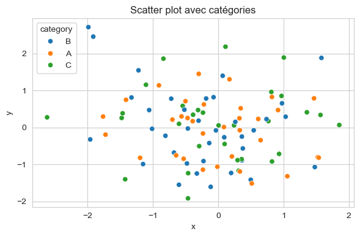
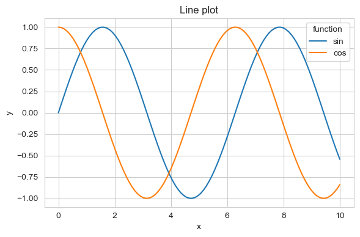
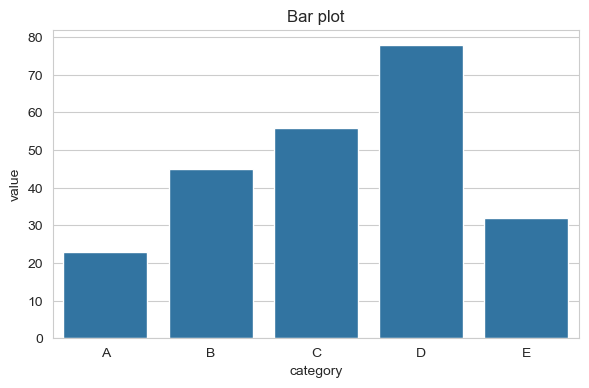
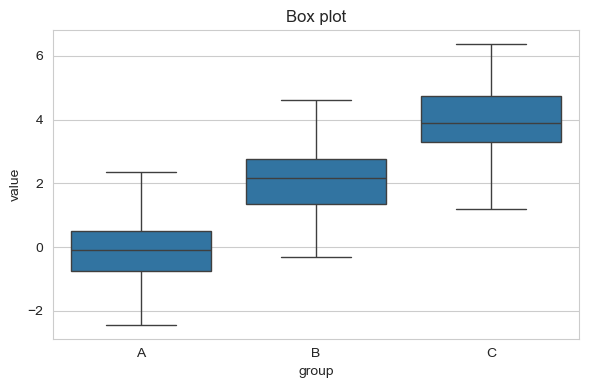
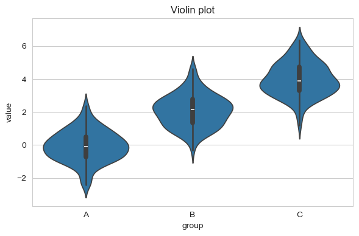
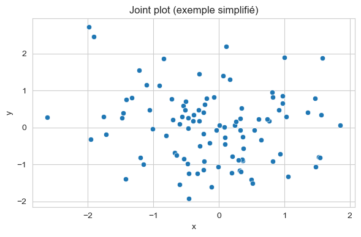

# Seaborn - Guide de référence rapide

> Pense-bête complet pour maîtriser Seaborn - Bibliothèque de visualisation statistique basée sur Matplotlib

---

## Table des matières

1. [Installation et import](#installation-et-import)
2. [Configuration et styles](#configuration-et-styles)
3. [Graphiques relationnels](#graphiques-relationnels)
4. [Graphiques catégoriels](#graphiques-catégoriels)
5. [Distributions](#distributions)
6. [Matrices de corrélation et heatmaps](#matrices-de-corrélation-et-heatmaps)
7. [Graphiques avancés](#graphiques-avancés)
8. [Personnalisation](#personnalisation)
9. [Intégration avec Pandas](#intégration-avec-pandas)
10. [Méthodes utiles supplémentaires](#méthodes-utiles-supplémentaires)

---

## Installation et import

```python
import seaborn as sns
import matplotlib.pyplot as plt
import pandas as pd
import numpy as np
```

**Convention standard** : importer Seaborn avec l'alias `sns`.

**Installation** :
```bash
pip install seaborn
# ou avec conda
conda install seaborn
```

**Note** : Seaborn nécessite Matplotlib et Pandas.

---

## Configuration et styles

### Styles prédéfinis

```python
# Styles disponibles
sns.set_style("whitegrid")      # Grille blanche (défaut)
sns.set_style("darkgrid")       # Grille sombre
sns.set_style("white")          # Fond blanc sans grille
sns.set_style("dark")           # Fond sombre sans grille
sns.set_style("ticks")          # Avec graduations

# Réinitialiser le style
sns.reset_orig()                # Style Matplotlib par défaut
```

### Palettes de couleurs

```python
# Palettes prédéfinies
sns.set_palette("husl")         # Palette qualitative
sns.set_palette("Set2")         # Palette catégorielle
sns.set_palette("viridis")      # Palette séquentielle

# Palette personnalisée
sns.set_palette(["#FF5733", "#33FF57", "#3357FF"])

# Voir les palettes disponibles
sns.palettes.SEABORN_PALETTES
```

### Configuration globale

```python
# Configuration du contexte (taille des éléments)
sns.set_context("paper")        # Petit (pour papiers)
sns.set_context("notebook")     # Moyen (défaut)
sns.set_context("talk")         # Grand (pour présentations)
sns.set_context("poster")       # Très grand (pour posters)

# Configuration combinée
sns.set_style("whitegrid", {"grid.color": ".6", "grid.alpha": 0.3})
```

---

## Graphiques relationnels

### Scatter plot (relplot)

```python
import seaborn as sns
import pandas as pd
import numpy as np

# Créer des données
df = pd.DataFrame({
    'x': np.random.randn(100),
    'y': np.random.randn(100),
    'category': np.random.choice(['A', 'B', 'C'], 100)
})

# Scatter plot simple
sns.scatterplot(data=df, x='x', y='y')
plt.show()

# Scatter plot avec catégories
sns.scatterplot(data=df, x='x', y='y', hue='category')
plt.show()
```



### Line plot

```python
# Line plot simple
sns.lineplot(data=df, x='x', y='y')

# Line plot avec plusieurs séries
df_line = pd.DataFrame({
    'x': np.linspace(0, 10, 100),
    'y1': np.sin(np.linspace(0, 10, 100)),
    'y2': np.cos(np.linspace(0, 10, 100))
})
sns.lineplot(data=df_line, x='x', y='y1', label='sin')
sns.lineplot(data=df_line, x='x', y='y2', label='cos')
plt.legend()
plt.show()
```



### Relplot (graphique relationnel flexible)

```python
# Relplot permet de créer des scatter ou line plots avec faceting
sns.relplot(data=df, x='x', y='y', hue='category', 
            col='category', kind='scatter')
plt.show()

# Relplot avec style et taille
sns.relplot(data=df, x='x', y='y', hue='category', 
            size='value', style='category')
plt.show()
```

---

## Graphiques catégoriels

### Bar plot

```python
df_bar = pd.DataFrame({
    'category': ['A', 'B', 'C', 'D', 'E'],
    'value': [23, 45, 56, 78, 32]
})

# Bar plot simple
sns.barplot(data=df_bar, x='category', y='value')
plt.show()
```



### Box plot

```python
df_box = pd.DataFrame({
    'value': np.concatenate([
        np.random.normal(0, 1, 100),
        np.random.normal(2, 1, 100),
        np.random.normal(4, 1, 100)
    ]),
    'group': ['A']*100 + ['B']*100 + ['C']*100
})

# Box plot
sns.boxplot(data=df_box, x='group', y='value')
plt.show()
```



### Violin plot

```python
# Violin plot (combinaison box plot + distribution)
sns.violinplot(data=df_box, x='group', y='value')
plt.show()
```



### Strip plot et swarm plot

```python
# Strip plot (points individuels)
sns.stripplot(data=df_box, x='group', y='value', jitter=True)

# Swarm plot (points sans chevauchement)
sns.swarmplot(data=df_box, x='group', y='value')
```

### Catplot (graphique catégoriel flexible)

```python
# Catplot permet différents types de graphiques catégoriels
sns.catplot(data=df_box, x='group', y='value', kind='box')
sns.catplot(data=df_box, x='group', y='value', kind='violin')
sns.catplot(data=df_box, x='group', y='value', kind='bar')
sns.catplot(data=df_box, x='group', y='value', kind='strip')
```

---

## Distributions

### Histogramme

```python
data = np.random.normal(100, 15, 1000)

# Histogramme simple
sns.histplot(data=data, bins=30)
plt.show()

# Histogramme avec KDE (Kernel Density Estimation)
sns.histplot(data=data, bins=30, kde=True)
plt.show()
```


### KDE plot (densité)

```python
# KDE plot seul
sns.kdeplot(data=data)

# KDE plot avec plusieurs distributions
sns.kdeplot(data=df_box, x='value', hue='group')
```

### Distplot (obsolète, utiliser histplot)

```python
# ⚠️ distplot est obsolète, utiliser histplot à la place
# sns.distplot(data)  # Ne pas utiliser
sns.histplot(data=data, kde=True)  # Utiliser cette syntaxe
```

### Joint plot

```python
# Joint plot (scatter + histogrammes marginaux)
sns.jointplot(data=df, x='x', y='y', kind='scatter')
plt.show()

# Différents types
sns.jointplot(data=df, x='x', y='y', kind='hex')    # Hexagones
sns.jointplot(data=df, x='x', y='y', kind='kde')    # KDE 2D
sns.jointplot(data=df, x='x', y='y', kind='reg')    # Régression
```



### Pair plot

```python
# Pair plot (matrice de scatter plots)
df_pair = pd.DataFrame({
    'x1': np.random.randn(100),
    'x2': np.random.randn(100),
    'x3': np.random.randn(100),
    'category': np.random.choice(['A', 'B'], 100)
})

# Pair plot simple
sns.pairplot(df_pair)

# Pair plot avec catégories
sns.pairplot(df_pair, hue='category', diag_kind='kde')
plt.show()
```


---

## Matrices de corrélation et heatmaps

### Heatmap

```python
# Heatmap simple
data_heat = np.random.rand(10, 10)
sns.heatmap(data_heat, annot=True, fmt='.2f', cmap='viridis')
plt.show()
```


### Matrice de corrélation

```python
# Créer une matrice de corrélation
df_corr = pd.DataFrame({
    'x1': np.random.randn(100),
    'x2': np.random.randn(100),
    'x3': np.random.randn(100),
    'x4': np.random.randn(100)
})
correlation_matrix = df_corr.corr()

# Afficher la matrice de corrélation
sns.heatmap(correlation_matrix, annot=True, cmap='coolwarm', 
            center=0, square=True, linewidths=1)
plt.title('Matrice de corrélation')
plt.show()
```

### Clustermap

```python
# Clustermap (heatmap avec clustering hiérarchique)
sns.clustermap(correlation_matrix, annot=True, cmap='viridis')
plt.show()
```

---

## Graphiques avancés

### FacetGrid (grilles de graphiques)

```python
# Créer une grille de graphiques
g = sns.FacetGrid(df, col='category', hue='category')
g.map(plt.scatter, 'x', 'y')
g.add_legend()
plt.show()

# Avec différents types de graphiques
g = sns.FacetGrid(df, col='category', row='subcategory')
g.map(sns.histplot, 'value')
plt.show()
```

### PairGrid (grille de pair plots personnalisée)

```python
# PairGrid pour personnaliser les pair plots
g = sns.PairGrid(df_pair, hue='category')
g.map_diag(sns.histplot)
g.map_upper(sns.scatterplot)
g.map_lower(sns.kdeplot)
g.add_legend()
plt.show()
```

### Regression plots

```python
# Regression plot (scatter + ligne de régression)
sns.regplot(data=df, x='x', y='y')
plt.show()

# Avec options
sns.regplot(data=df, x='x', y='y', 
            scatter_kws={'alpha': 0.5},
            line_kws={'color': 'red'})
```

### Residual plot

```python
# Residual plot (pour vérifier la qualité de la régression)
sns.residplot(data=df, x='x', y='y')
plt.show()
```

---

## Personnalisation

### Personnalisation des couleurs

```python
# Palette personnalisée
custom_palette = sns.color_palette("husl", 3)
sns.scatterplot(data=df, x='x', y='y', hue='category', palette=custom_palette)

# Palette séquentielle
sns.scatterplot(data=df, x='x', y='y', hue='value', palette='viridis')
```

### Personnalisation des axes et titres

```python
# Après avoir créé le graphique
ax = sns.scatterplot(data=df, x='x', y='y')
ax.set_xlabel('Label X personnalisé', fontsize=12)
ax.set_ylabel('Label Y personnalisé', fontsize=12)
ax.set_title('Titre personnalisé', fontsize=14, fontweight='bold')
plt.show()
```

### Personnalisation avec matplotlib

```python
# Seaborn est basé sur Matplotlib, donc on peut utiliser toutes les fonctions matplotlib
fig, ax = plt.subplots(figsize=(10, 6))
sns.scatterplot(data=df, x='x', y='y', ax=ax)
ax.set_xlim(-3, 3)
ax.set_ylim(-3, 3)
ax.grid(True, alpha=0.3)
plt.tight_layout()
plt.show()
```

---

## Intégration avec Pandas

### Utilisation directe avec DataFrames

```python
# Seaborn fonctionne directement avec les DataFrames Pandas
df = pd.read_csv('data_files/population_total.csv')

# Visualiser les données
sns.lineplot(data=df, x='year', y='value', hue='country')
plt.show()
```

### Groupby et visualisation

```python
# Grouper et visualiser
df_grouped = df.groupby('category')['value'].mean().reset_index()
sns.barplot(data=df_grouped, x='category', y='value')
plt.show()
```

### Pivot et heatmap

```python
# Créer une table pivot et la visualiser
df_pivot = df.pivot_table(values='value', index='row', columns='col')
sns.heatmap(df_pivot, annot=True, cmap='viridis')
plt.show()
```

---

## Méthodes utiles supplémentaires

### Charger des datasets intégrés

```python
# Datasets intégrés dans Seaborn
tips = sns.load_dataset('tips')
flights = sns.load_dataset('flights')
iris = sns.load_dataset('iris')

# Visualiser
sns.scatterplot(data=iris, x='sepal_length', y='sepal_width', hue='species')
plt.show()
```

### Statistiques intégrées

```python
# Box plot avec statistiques
sns.boxplot(data=df_box, x='group', y='value', showmeans=True)

# Bar plot avec intervalles de confiance
sns.barplot(data=df_bar, x='category', y='value', ci='sd')  # Écart-type
```

### Annotations automatiques

```python
# Ajouter des annotations
ax = sns.barplot(data=df_bar, x='category', y='value')
for i, v in enumerate(df_bar['value']):
    ax.text(i, v + 1, str(v), ha='center', va='bottom')
plt.show()
```

### Sauvegarde

```python
# Sauvegarder les graphiques (même méthode que Matplotlib)
fig = plt.figure(figsize=(10, 6))
sns.scatterplot(data=df, x='x', y='y')
plt.savefig('graphique.png', dpi=300, bbox_inches='tight')
plt.close()
```

### Combinaison de graphiques

```python
# Combiner plusieurs graphiques Seaborn
fig, axes = plt.subplots(2, 2, figsize=(12, 10))

sns.scatterplot(data=df, x='x', y='y', ax=axes[0, 0])
sns.histplot(data=df['x'], ax=axes[0, 1])
sns.boxplot(data=df_box, x='group', y='value', ax=axes[1, 0])
sns.heatmap(correlation_matrix, annot=True, ax=axes[1, 1])

plt.tight_layout()
plt.show()
```

### Graphiques avec données temporelles

```python
# Charger des données temporelles
df_time = pd.read_csv('data_files/population_total.csv')
df_time['date'] = pd.to_datetime(df_time['year'], format='%Y')

# Visualiser
sns.lineplot(data=df_time, x='date', y='value', hue='country')
plt.xticks(rotation=45)
plt.tight_layout()
plt.show()
```

### Graphiques avec données catégorielles multiples

```python
# Graphique avec plusieurs variables catégorielles
df_multi = pd.DataFrame({
    'category1': np.random.choice(['A', 'B'], 200),
    'category2': np.random.choice(['X', 'Y'], 200),
    'value': np.random.randn(200)
})

sns.catplot(data=df_multi, x='category1', y='value', 
            hue='category2', kind='box')
plt.show()
```

---

## Récapitulatif des conventions importantes

### Syntaxe de base

| Opération | Syntaxe |
|-----------|---------|
| Import | `import seaborn as sns` |
| Scatter plot | `sns.scatterplot(data=df, x='x', y='y')` |
| Line plot | `sns.lineplot(data=df, x='x', y='y')` |
| Histogramme | `sns.histplot(data=df, x='value')` |
| Box plot | `sns.boxplot(data=df, x='cat', y='value')` |
| Heatmap | `sns.heatmap(data=matrix)` |

### Types de graphiques

| Type | Fonction | Usage |
|------|----------|-------|
| Relationnel | `scatterplot()`, `lineplot()`, `relplot()` | Relations entre variables |
| Catégoriel | `barplot()`, `boxplot()`, `violinplot()`, `catplot()` | Comparaisons catégorielles |
| Distribution | `histplot()`, `kdeplot()`, `distplot()` | Distributions |
| Matrice | `heatmap()`, `clustermap()` | Matrices et corrélations |
| Multi-dimensionnel | `pairplot()`, `jointplot()` | Relations multiples |

### Avantages de Seaborn

- **Intégration Pandas** : Fonctionne directement avec DataFrames
- **Statistiques intégrées** : Intervalles de confiance, régressions automatiques
- **Styles élégants** : Graphiques plus beaux par défaut que Matplotlib
- **Faceting** : Création facile de grilles de graphiques
- **Palettes de couleurs** : Gestion avancée des couleurs

---

## Ressources supplémentaires

- **Documentation officielle** : https://seaborn.pydata.org/
- **Galeries d'exemples** : https://seaborn.pydata.org/examples/
- **Tutoriels** : https://seaborn.pydata.org/tutorial.html

---

*Document créé pour servir de pense-bête Seaborn - Mise à jour régulière recommandée*

